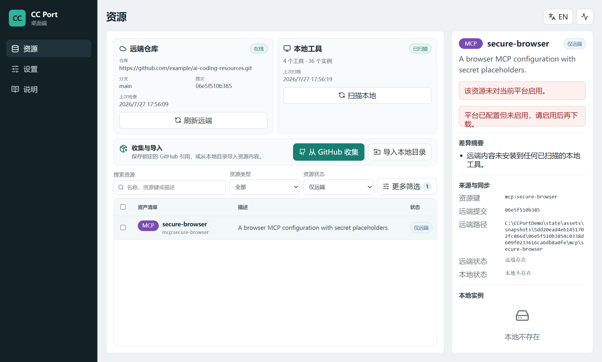
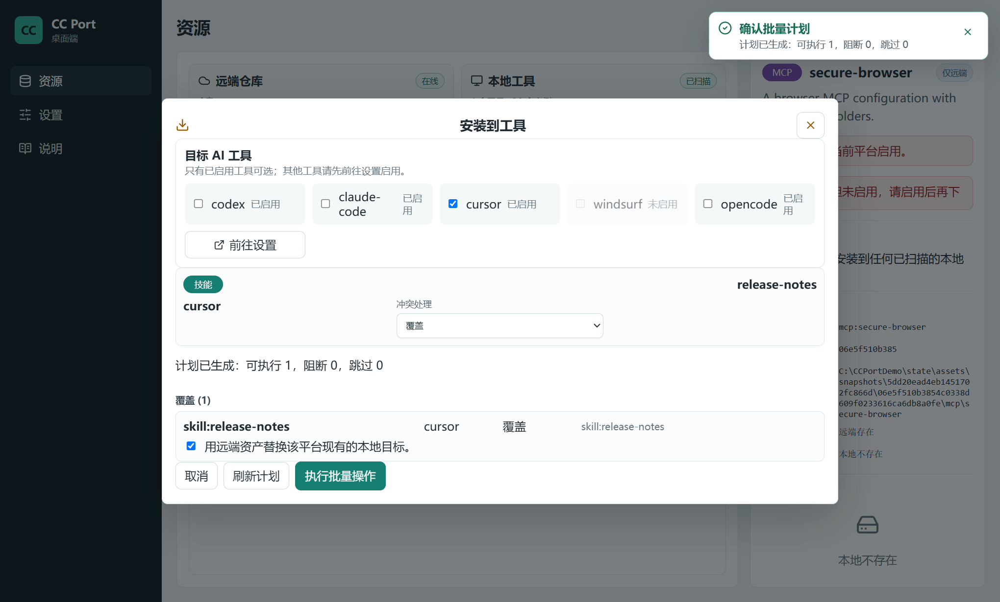
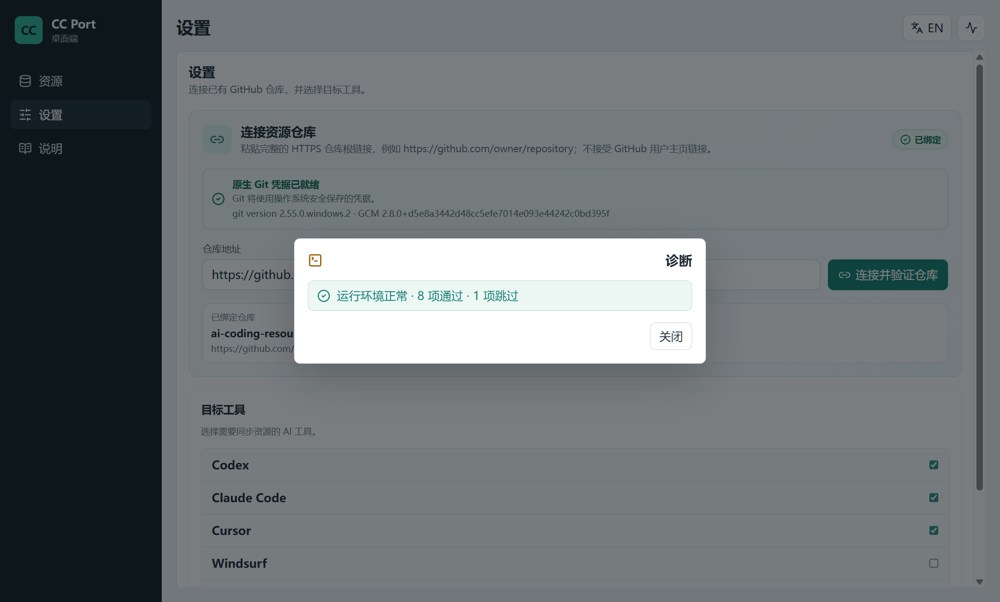

# CC Port

> 把分散在 Codex、Claude Code、Cursor、Windsurf 和 OpenCode 的 Skill、MCP、Rule、Prompt、Plugin，安全同步到你控制的通用 Git 资源仓库。

[English](README.en.md) · [下载 Windows 安装器](https://github.com/Ling-ye/cc-port/releases/tag/v0.5.4) · [快速开始](docs/getting-started.md) · [报告问题](https://github.com/Ling-ye/cc-port/issues)

[](https://github.com/Ling-ye/cc-port/actions/workflows/ci.yml)
[](LICENSE)


CC Port 是一个面向多 AI coding 工具的本地桌面资源管理器。它扫描每个工具的原生目录，以你控制的 Git 仓库作为跨设备事实源，并在真正写入前生成明确的操作计划。资源仓库和 `registry.yaml` 是开放格式，不要求其他消费者安装或理解 CC Port。

## 一眼看懂

| 资源清单与平台状态 | 写入前的操作计划 | 设置与环境诊断 |
| --- | --- | --- |
|  |  |  |

## 它解决什么问题

- **配置散落**：Skill、MCP、Rule、Prompt 和 Plugin 分别藏在多个工具目录中，难以盘点。
- **多设备漂移**：同一资源在不同电脑和工具中逐渐变成不同版本。
- **同步不安全**：复制目录容易覆盖手工配置，删除和失败操作也难以恢复。
- **凭据风险**：MCP 配置可能混入 Token 或环境变量字面值，不适合直接提交。

CC Port 将远端仓库快照与每个平台的本地实例逐项比较。上传、安装、另存副本和设置安装别名都先生成计划；写入使用备份、目标锁、结果校验和失败回滚。

### 上传到仓库

在资源页勾选资产并点击“上传到仓库”后，CC Port 会立即刷新远端快照并重新扫描本地实例。检查期间只显示进度和取消入口，不会提前显示冲突选项或执行按钮；检查完成后才展示本次得到的本地、远端和整体状态。确认后点击“上传到远端仓库”即可执行并推送。

“本地存在、远端不存在”表示将在远端新增资产，不属于冲突，也不会生成空的资源编辑卡或显示“用远端资产替换本地目标”；该替换确认只用于下载/安装。只有本地与远端都存在且内容或元数据不同时，上传界面才显示覆盖或重命名等冲突处理选项。

根级 Windows 符号链接和目录联接可以作为本地资源来源；上传时 CC Port 会保留逻辑安装路径用于识别资源，解引用目标后生成普通文件快照，仓库中不会写入链接。指向已知 `.agents/skills` 规范目录的链接自动信任，其他目标会在最新扫描结果中显示链接类型、目标和 reparse tag，并要求单独确认。资源目录内部的嵌套链接、悬空链接、循环链接和不可读取重解析点都会阻断该资源，但不会中断其他资源的扫描。

WSL 创建的 LX 符号链接与 Windows 原生符号链接不是同一种 reparse point，Windows 桌面服务不会尝试经由 WSL 桥接读取它。遇到此类阻断时，请在 Windows 中重建原生链接，或用资源安装器的复制模式（例如 `npx skills add ... --copy`）重新安装。

本地资产扫描会同时检查所有已启用平台配置的 `skills_dir`、`mcp_json` 和 `plugins_dir`，因此 Claude Code 安装在 WSL 时，可以分别配置为 `\\wsl.localhost\<发行版>\home\<用户>\.claude\skills`、`\\wsl.localhost\<发行版>\home\<用户>\.claude.json` 和 `\\wsl.localhost\<发行版>\home\<用户>\.claude\plugins`。普通 WSL 路径中的 Skill、MCP 和内容型 Plugin 都可以下载并进入上传计划；首次上传内容型 Plugin 仍要求确认其为自有源码。目录中的 Linux 符号链接仍按 WSL LX 链接单项阻断。配置路径与平台默认目录相同时会自动去重，不会重复展示资源。

### 通用 Registry v1 与仓库检查

仓库中的资源文件或外部 `source` 是事实，`registry.yaml` 只是可移植成员清单。它只保存 `(kind, name)` 稳定身份，以及互斥的仓库相对 `path` 或外部 `source`：

```yaml
version: 1
resources:
  - kind: skill
    name: code-review
    path: skills/code-review
  - kind: plugin
    name: browser-tools
    source:
      type: marketplace
      locator: openai-bundled/browser-tools
      revision: latest
```

描述、版本、作者、许可证、标签、哈希和检查时间不写入 Registry；MCP 配置保存在 `mcp/<name>/mcp.json|yaml|yml`。平台白名单、安装别名和插件启用意图可以进入可选的 `cc-port.yaml`，其他工具无需读取它。完整字段见 [Registry v1 规格](docs/specs/registry-v1.md)。

每次远端刷新都会对同一个 commit 只读检查 Registry，但不会自动修改仓库。资源页的“检查仓库”会预览待新增、待移除、人工处理项和最终 YAML diff；用户确认后，CC Port 才以一次只包含 `registry.yaml` 的提交修复并普通推送。修复绝不改写、移动或删除资源内容，也不修改 `cc-port.yaml`。

Registry 缺失、YAML 损坏或本身是链接时只显示诊断，不显示应用按钮；仓库仍显示已连接，本地扫描仍可使用，但上传和安装等依赖远端清单的动作会阻断。CLI 使用：

```text
cc-port resource registry-check --json
cc-port resource registry-repair --dry-run
cc-port resource registry-repair --yes --choices choices.yaml
```

## 五步开始

1. 安装 [Git for Windows](https://git-scm.com/download/win)，并确认 Git Credential Manager 可用。
2. 从 [v0.5.4 Public Beta](https://github.com/Ling-ye/cc-port/releases/tag/v0.5.4) 下载 `cc-port_0.5.4_windows_x64_setup.exe`。
3. 在 GitHub 创建一个空的私有仓库，作为你自己的资源仓库。
4. 启动 CC Port，在“设置”中粘贴仓库的 HTTPS 地址并完成验证。
5. 扫描本机资源，在资源页逐项选择上传到仓库或安装到目标工具。

安装包已经包含桌面程序和 Python sidecar；普通用户不需要安装 Python、Node.js 或 Rust。完整流程、首次配置和卸载方式见[快速开始](docs/getting-started.md)。

开发环境可运行 `Set-ExecutionPolicy -Scope Process Bypass -Force; & .\scripts\setup.ps1` 自动检查并安装所需工具和依赖。脚本列出操作后会直接执行，不再要求输入 `y/n`；`-CheckOnly` 仍只检查而不修改环境。

## 安全边界

- **仓库归你所有**：CC Port 不提供托管云服务；资源保存在你指定的 Git 仓库。
- **凭据交给系统**：桌面端通过 Git Credential Manager 使用系统凭据，不读取或保存 GitHub Token。
- **先计划再写入**：桌面端和 CLI 在写操作前展示目标、动作与阻断原因。
- **不覆盖未接管内容**：所有权标记用于区分 CC Port 管理项与手工维护项。
- **悬空链接只替换链接本身**：下载目标是根级 Windows 原生悬空符号链接时，只有明确确认覆盖未接管目标后才会删除链接本身并写入普通内容，不会跟随或修改链接指向的位置。
- **可恢复写入**：安装、卸载、部署和恢复使用持久化事务、备份与失败回滚。
- **MCP 密钥占位**：采集 MCP 配置时，环境变量字面值会替换为 `${SECRET_NAME}` 占位符。
- **缺失不等于删除**：远端缺少某项资源不会触发隐式删除。

发现安全问题时，请不要创建公开 Issue；按照[安全策略](SECURITY.md)使用 GitHub 的私密漏洞报告。

## 支持范围

### 资源类型

| 类型 | 扫描与登记 | 资源仓库同步 | 安装到工具 |
| --- | :---: | :---: | :---: |
| Skill | ✓ | ✓ | ✓ |
| MCP Server | ✓ | ✓ | ✓ |
| Rule | ✓ | ✓ | ✓ |
| Prompt | ✓ | ✓ | ✓ |
| Plugin | ✓ | ✓ | ✓ |

### AI coding 工具

| 工具 | 状态 | 默认可写资源 |
| --- | --- | --- |
| Codex | 稳定 | Skill |
| Claude Code | 稳定 | Skill、MCP、Plugin |
| Cursor | 稳定 | Skill、MCP、Prompt |
| Windsurf | 实验性 | Skill、MCP |
| OpenCode | 实验性 | Skill、MCP、Rule、Prompt、Plugin |
| Cline、Gemini CLI | 仅发现 | 暂无完整可写平台预设 |

### Cursor Prompt 命令

Cursor 预设把 Prompt `<name>` 安装为全局自定义命令
`~/.cursor/commands/<name>.md`；设置平台安装别名后，文件名改用该别名。资源仓库
仍以 `prompts/<name>/` 保存可移植内容。下载到这个文件式目标时，远端 Prompt
必须是一个 Markdown 文件，或目录根级恰好包含一个非符号链接 `.md` 文件；零个或
多个根级 Markdown 文件都会阻断计划，不会任意选择。

已有自定义平台若没有设置 `prompts_dir`，仍按旧行为使用
`rules_dir/<install-name>`，避免现有配置被静默迁移。完整规则见
[Cursor Prompt 命令安装规格](docs/specs/cursor-prompt-commands.md)。

高级用户可以在 `config.toml` 中添加自定义平台路径。具体字段见[配置示例](config/config.example.toml)。

## 三种入口

- **桌面 GUI**：日常扫描、比较、上传、安装和环境诊断；说明页提供项目仓库与 GitHub Star 支持入口。
- **CLI**：脚本化、批量操作、历史恢复和状态维护。
- **MCP Server**：让支持 MCP 的 AI coding 工具调用 CC Port 能力。

三种入口共享同一套 Python 核心逻辑。架构边界和同步状态机见[架构文档](docs/architecture.md)。

## 当前限制

- Public Beta 仅正式支持 Windows 10/11 x64。
- v0.5.4 安装器尚未代码签名，Windows SmartScreen 可能显示“未知发布者”。
- 目标电脑必须安装 Git for Windows，并配置 Git Credential Manager。
- 桌面端不会替你创建、删除仓库或修改仓库可见性。
- 当前没有自动更新；升级时请从 Releases 下载新版本。
- 桌面端聚焦资源管理；部分历史恢复和维护能力仍只在 CLI/Desktop API 提供。

遇到安装、登录或同步问题，请先查看[故障排查](docs/troubleshooting.md)。

## 文档

- [快速开始](docs/getting-started.md)
- [故障排查](docs/troubleshooting.md)
- [开发指南](docs/development.md)
- [架构](docs/architecture.md)
- [Registry v1 规格](docs/specs/registry-v1.md)
- [桌面打包与发布](docs/packaging-and-deployment.md)
- [v0.5.4 发布说明](docs/releases/v0.5.4.md)
- [功能规格](docs/specs/)
- [变更记录](CHANGELOG.md)

## 参与贡献

Bug、文档修正和小改动可以直接提交 PR。较大的功能或行为变化请先创建 Issue，确认问题和范围后再实现。详细规则见[贡献指南](CONTRIBUTING.md)。

## License

[MIT](LICENSE) © 2026 Lingye · [第三方软件声明](THIRD_PARTY_NOTICES.md)
