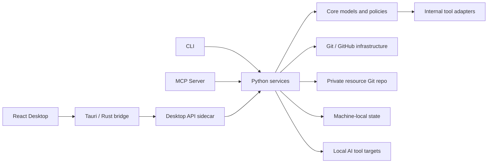
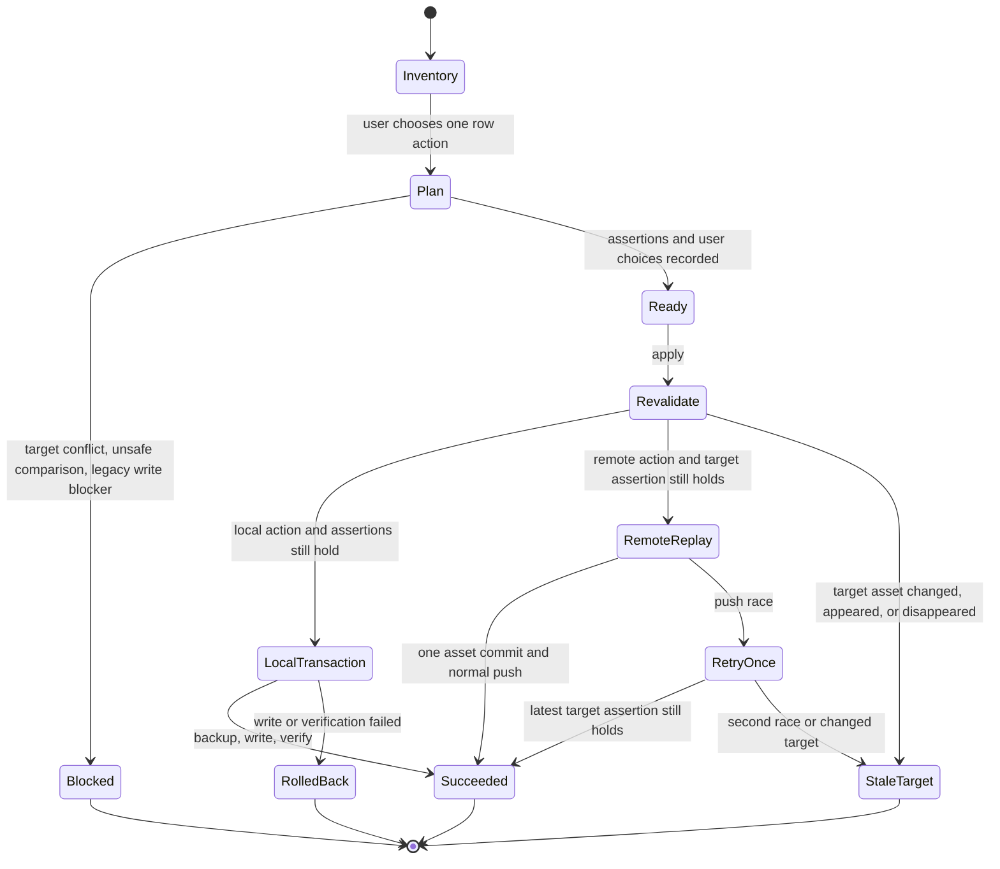

# LPM 项目架构

## 产品边界

LPM 定位为本地优先的 AI 工具资源管理器。管理对象包括 `skill`、`prompt`、`rule`、`plugin` 和 MCP server 配置；用户自己的私有 Git 仓库是跨设备事实源，本机状态目录只保存备份、所有权和临时操作数据。

当前采用模块化单体，不拆分独立服务：

- Python package 承载全部领域规则和用例。
- React 只负责交互和状态展示。
- Tauri/Rust 只负责桌面外壳、sidecar 调用和系统路径打开。
- CLI、Desktop API 和 MCP Server 复用同一套 Python services。

当前不提供第三方适配器插件 API，也不引入 SQLite。registry 已升级为 v6，以 `kind:name` 作为复合资源身份；适配器契约先作为内部 API 演进，稳定后再决定是否外部开放。

## 组件关系



## Python 模块边界

| 模块 | 职责 | 主要约束 |
| --- | --- | --- |
| `core.models` / `core.registry` | registry v6 复合键模型、v5 迁移和读写 | 私有仓库配置分支中的资源索引是跨设备事实源 |
| `core.tool_adapters` | 工具能力、默认路径、发现信号和安装机制 | 当前仅内部使用，不承诺第三方兼容性 |
| `core.resource_files` | 资源复制与同步共用的文件策略 | 排除真实 `.env`、构建产物、依赖目录和符号链接 |
| `core.secret_scan` | 资源文本的凭据模式检查 | 只返回脱敏预览，不在日志中保存真实值 |
| `core.ownership` | 目录与 MCP entry 的所有权 | 未管理目标不能被普通覆盖或卸载 |
| `services.asset_sync` | 逻辑资源并集、远端快照、批量计划、哈希重验证、批量上传单提交与逐项下载事务 | 不信任前端路径或指纹；不强推；不隐式删除 |
| `services.resource_sync` | 弃用兼容：旧 Git 分歧检测、worktree 合并与推送 | 仅保留一个发布版本，用于清理遗留工作区状态 |
| `services.resource_commit` | 资源级提交预览、管理路径限制和待推送内容扫描 | 不提供通用 Git 暂存区；非管理路径和敏感内容默认阻断 |
| `services.resource_repo_lock` | 资源仓库进程内/跨进程写锁 | 同仓库写操作串行；嵌套服务调用可重入 |
| `services.env_manager` | 资产扫描使用的只读工具、资源与 MCP 配置发现 | 不提供环境采集、仓库级环境差异、快照迁移或部署入口；MCP 占位符化由 `core.secrets` 统一处理 |
| `services.local_transaction` | 共享快照、哈希、ChangeSet 与回滚执行 | 全部目标加锁后才创建操作记录与快照；所有本地写入使用相同恢复语义 |
| `services.state_lock` | 跨进程目标路径锁 | 规范化绝对路径作为锁键；多目标固定顺序；锁覆盖快照、写入、验证和回滚 |
| `services.operation_state` / `operation_history` | 持久化、查询和显式恢复操作 | 状态与私有 Git 仓库分离；恢复默认阻断漂移 |
| `services.state_maintenance` | 孤立备份检查、导出、隔离、最终删除和维护审计查询 | 不直接删除孤立备份；导出不跟随符号链接；隔离与删除分两次确认 |
| `services.state_retention` | 操作记录与备份容量统计、清理计划和显式执行 | 先预览再确认；运行中和最近操作受保护；孤立备份只统计 |
| `services.installer` | 资源缓存、平台分发和事务卸载 | 单个资源是事务边界，平台白名单和所有权必须在执行层验证 |

## 数据位置

### 私有资源 Git 仓库

```text
registry.yaml
skills/
prompts/
rules/
plugins/
mcp/
resources/  # 兼容旧仓库布局
  skills/
  prompts/
  rules/
  plugins/
  mcp/
```

该仓库只保存可跨设备同步的数据，不保存真实密钥、机器备份、临时 worktree 或操作日志。

### 本机状态目录

Windows 默认为 `%LOCALAPPDATA%\LPM`；其他系统使用用户状态目录。`LPM_STATE_HOME` 可覆盖默认值。

```text
backups/
exports/orphans/
locks/
maintenance/*.json
maintenance/orphans/<quarantine-id>/
maintenance/trash/<cleanup-id>/
operations/
ownership/mcp.json
assets/remotes/
assets/snapshots/
asset-plans/<operation-id>/
sync/<operation-id>/  # 弃用兼容
```

### AI 工具目标

工具目标路径来自 `PlatformProfile` 和内部 `ToolAdapter`。目录型资源写入 `.lpm-managed.json`；MCP 只拥有指定 server entry，不拥有整个 JSON 配置文件。

## 资产同步状态机



清单从配置分支最新提交生成只读快照，不修改旧本地 Git 工作区。计划记录远端提交、目标资产存在性与指纹、本地源指纹、解析出的目标路径和用户选择；apply 时全部重新计算。

若远端分支只发生无关变化，远端写操作会在最新提交上重放并普通推送。若目标资产新增、删除或改变，则返回 `stale-target`。推送竞态只自动重试一次，且每次远端写入只创建一个资产级提交。

旧 `services.resource_sync` 状态机和 `sync/<operation-id>` worktree 仅作为一版兼容层存在。遗留工作区处于 dirty、ahead、diverged、wrong-branch 或有待处理旧计划时，资产清单仍可读取，但远端写入被阻断。

## 本地变更事务

安装、卸载和环境部署复用 `LocalChangeTransaction`。执行顺序：

1. 生成部署计划并过滤平台白名单。
2. 检查目录或 MCP entry 所有权。
3. 对规范化目标路径排序并获取全部跨进程写锁。
4. 创建 operation id，记录所有目标。
5. 把已有目标备份到本机状态目录。
6. 逐项写入资源缓存和工具目标。
7. 验证执行结果并写入所有权。
8. 成功则记录 `succeeded`；失败则反向恢复已尝试目标并记录 `rolled_back` 或 `rollback_failed`，最后释放锁。

显式 `force` 只用于用户主动确认覆盖未管理目标的部署入口；普通同步和卸载保持保守行为。

手动恢复会创建新的 `operation-restore` 事务。默认要求目标仍等于原操作的 `after_hash`；发生漂移时阻断，只有用户显式 force 才覆盖。恢复动作本身也先备份当前状态，因此恢复失败可回到恢复开始前。

批量资源同步不是跨资源的大事务，而是多个单资源事务。一个资源失败不会撤销此前已经成功且可独立审计的其他资源。

## 本机状态保留

保留策略同时使用三个阈值：操作保留天数、无条件保护的最近操作数量、备份容量软上限。计划阶段只读统计 `operations/` 与 `backups/`，按从旧到新的顺序生成候选；执行阶段在维护锁内重新规划，并对选中的 operation record 和 backup 再次加锁。

清理只接受最新计划中仍然合格的显式 operation id。每个候选先移动到 `maintenance/trash/<cleanup-id>/` 再删除；失败时尝试恢复原位置，并在 `maintenance/prune-<cleanup-id>.json` 写入删除结果与失败详情。没有对应合法操作记录的孤立备份只进入容量统计，不自动删除。

孤立备份使用独立生命周期。用户可以先导出 ZIP；隔离动作在锁内重新确认没有合法操作记录，然后原子移动到 `maintenance/orphans/<quarantine-id>/`。物理删除只接受隔离批次，并产生第二条维护审计，因此普通 retention prune 永远不能直接删除未知恢复数据。

操作历史列表只返回服务端分页摘要，目标数组与 metadata 通过单条详情接口按需读取。`maintenance/*.json` 中的状态清理、隔离和永久删除审计通过统一列表和详情接口展示。

## 工具适配器成熟度

- 稳定：Codex、Claude Code、Cursor。
- 实验：Windsurf、Cline、opencode、Gemini CLI。

稳定表示发现信号和当前支持资源类型已经集中到适配器契约中，不表示上游工具格式永远不变。新增工具先以内置实验适配器进入，完成发现、计划、安装、卸载和安全测试后再升级为稳定。

## 后续开发顺序

1. 为内部适配器契约增加版本、能力声明和兼容性测试矩阵，再决定是否开放第三方 adapter API。
2. 为桌面端增加系统文件选择器和打开导出目录能力，替代当前默认状态目录导出路径。
3. 增加安装包签名、GitHub Release 和自动更新流程。
4. 只有在 JSON 状态查询和并发写入成为实际瓶颈时，才评估 SQLite。
